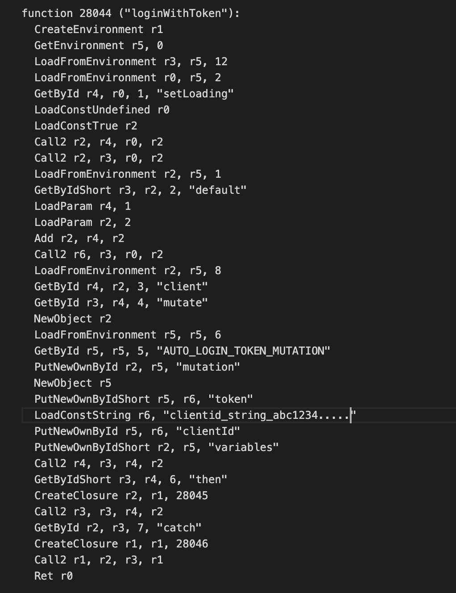
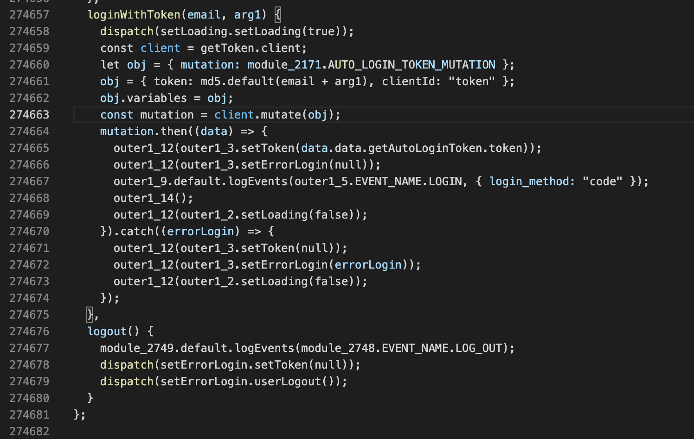

[](https://github.com/SymbioticSec/hermes-decomp/actions/workflows/build.yml)

Rust decompiler for **Hermes bytecode** (`.hbc`), the JS engine behind React Native. Supports **HBC 40 to 99**.

## Install

**Pre-built binaries** (Linux / macOS / Windows) from [Releases](https://github.com/SymbioticSec/hermes-decomp/releases) or [Actions](https://github.com/SymbioticSec/hermes-decomp/actions/workflows/build.yml):

| Asset suffix | Platform |
|---|---|
| `linux-x86_64` / `linux-arm64` | Linux |
| `macos-arm64` / `macos-x86_64` | macOS |
| `windows-x86_64` | Windows |

Archives include `hermes-decomp` and `hermes-mcp`. Verify: `shasum -a 256 -c SHA256SUMS`.

```bash
hermes-decomp update --check      # or --install / --version v0.1.7
```

**From source** (Rust 1.70+):

```bash
git clone https://github.com/SymbioticSec/hermes-decomp.git
cd hermes-decomp && cargo build --release
# → target/release/hermes-decomp  target/release/hermes-mcp
```

## Quick start

```bash
hermes-decomp info app.hbc
hermes-decomp disasm app.hbc --function 5 --info --show-offsets
hermes-decomp decompile app.hbc -o out.js          # progress on stderr
hermes-decomp decompile app.hbc --function 42
hermes-decomp tui app.hbc
hermes-decomp xref app.hbc --query "loginWithToken"
```





## What it does

| Area | Commands (highlights) |
|------|------------------------|
| **Read** | `info`, `disasm`, `decompile`, `tui`, `extract`, `modules`, `deps` |
| **Analyze** | `xref`, `callgraph`, `graphviz`, `closures`, `debug`, `dump`, `bin-diff` |
| **RE helpers** | `secrets`, `frida-hooks` |
| **Write** (bytecode only) | `emit-hasm`, `asm`, `asm-check`, `patch-string`, `patch-function`, `inject-stub`, `create` |

Full flags and examples → **[docs/USAGE.md](docs/USAGE.md)**.

Notes:

- Full-bundle `decompile` uses an on-disk **`.hdcache`** for fast reloads. Pass `--no-cache` to force.
- Write tools patch **bytecode / HASM**. They do **not** recompile decompiled JavaScript.
- `decompile -o …` prints pipeline stages on **stderr**.

## MCP & library

- **MCP server** (`hermes-mcp`) for AI assistants → **[docs/MCP.md](docs/MCP.md)**  
  Config template: [`mcp-config.example.json`](mcp-config.example.json)
- **Rust crate** `hbc-decomp` → **[docs/LIBRARY.md](docs/LIBRARY.md)**

```bash
cargo build --release -p hbc-decomp-mcp
```

## Contributing

See **[CONTRIBUTING.md](CONTRIBUTING.md)**. Please open an issue before a PR.

```bash
cargo build --release --workspace && cargo test --workspace
```

## Resources

- [Hermes Engine](https://hermesengine.dev/) · [React Native](https://reactnative.dev/)

## License

MIT. See [LICENSE](LICENSE).
